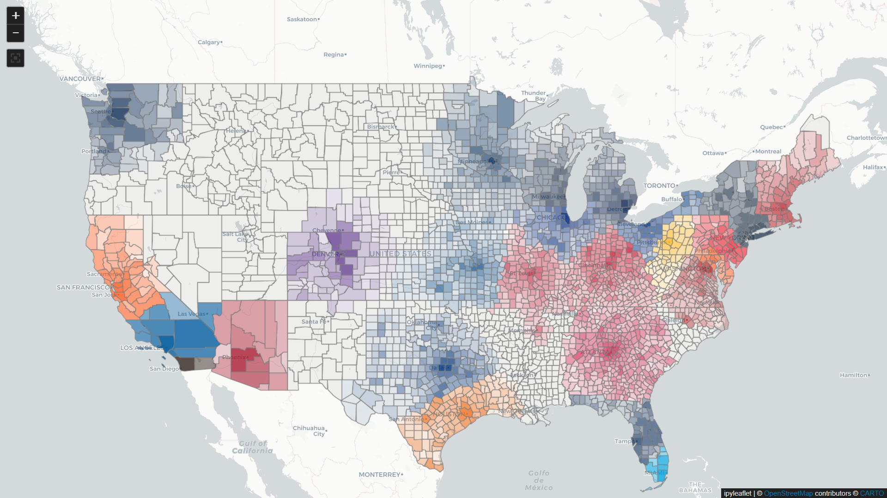
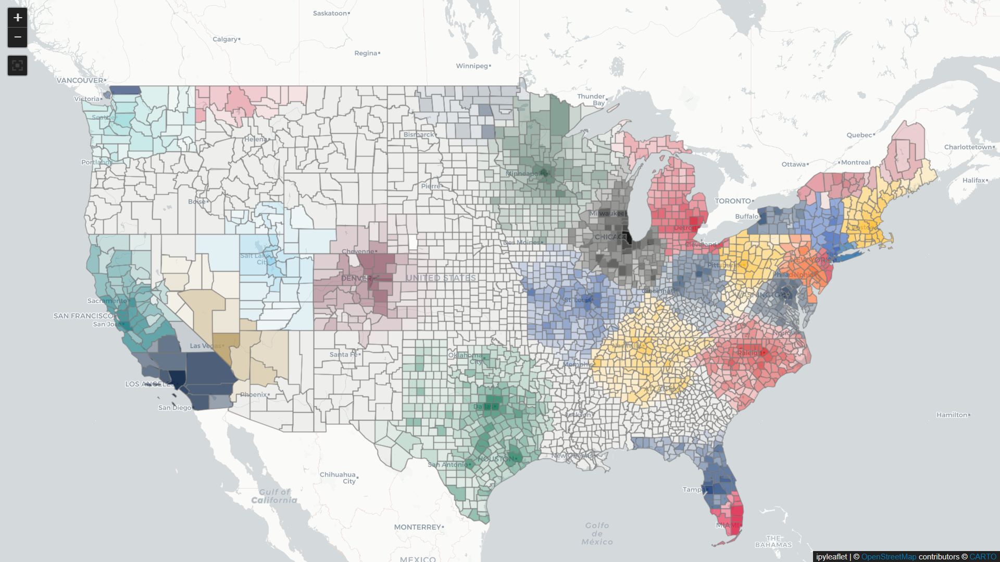

This project applies a mathematical model to U.S. counties to estimate the level of fan support for professional sports teams. It is inspired by several Tableau projects that visualize Twitter followers by county:

- https://public.tableau.com/app/profile/matt.sorenson/viz/NFLFollowerMap/NFLMap

- https://public.tableau.com/app/profile/matt.sorenson/viz/MLBFollowerMap/MLBMap

- https://public.tableau.com/app/profile/matt.sorenson/viz/NBAFollowerMap/NBAMap

- https://public.tableau.com/app/profile/matt.sorenson/viz/NHLFollowerMap/NHLMap

- https://public.tableau.com/app/profile/matt.sorenson/viz/MLSFanMap/MLSMap

These visualizations rely on Twitter followers, which often provide small sample sizes at the county level.

this model considers everyone a potential fan. There is a secondary value assigned to a county based on its distance from the venue that provide an multiplier to indicate the value the population of that county has to the team. A fan is a distant county is less likely to attend game(s) in person, but could buy a merchandise and other things. That multiply meet be 0.20 for a county 200 miles from the venue.

The term “Warz” comes from a related idea: a strategy simulation game in which players attempt to maximize fan bases by investing in teams across leagues.

#### Examples of MLB and NHL Heat Maps





#### Running 

- Currently, the model is implemented as a Jupyter notebook served via Voila.
(Still searching for a reliable and inexpensive hosting option.)

- You can also run it via Docker:

```
docker pull daltontf1212/sportwarzsim:latest

docker run -p 8866:8866 daltontf1212/sportwarzsim:latest
```

Navigate to http://localhost:8866/

#### Things taken into account:

- Popularity of the league / sport (league_weight)

- Long-term establishment of the team. This could called allegiance, equity, etc. Referred as "L"
    
    Represents durable support built over time. Builds over time by:
    
    - Existing continually in a market
        
    - Sustained fan engagement  

    - Sustained fan engagement

    - Can stagnate or decline during long periods of apathy, irrelevance, or losing      

- Short-term enthusiasm. ("S")
    
    Represents excitement, novelty, and momentum:

    - Expansion and relocated teams.

    - Strong recent performance (especially for teams that aren not already elite)
    
    - Arrival of marquee or phenom players

- National footprint. In the code, "N".

    Measures cultural influence beyond local geography:

    - Large markets 

    - Dedicated broadcaster like WGN (Chicago Cubs), TBS (Atlanta Braves) and KMOX Radio historically for the St. Louis Cardinals.

    - Star-driven brands (e.g., Messi, LeBron, Ohtani)

    - Modifiers:
    
    - Teams other than the nearest team with have an effective distance that is longer. 

    - Teams in other states will have a effective distance multiplier. Even bigger for teams in Canada
    
The code does none of the "L", "S" or "N" accumlation over time. The current values are subjective. Mentally modelling them would include:

- "L"
    
    - Team has existed in the same market for long time. Stagnates or even goes down with prolonged apathy indicated by "S". Example of losing "L" is the Pittsburgh Pirates. 

- "S":
    
    - Maybe reduced by period where other team in market have higher "S". Example would be St. Louis football Cardinals in 1980s when the long established baseball Cardinals played in three World Series'. Inability to build "L" when in theory a football team should be "top dog" (higher league_weight) in the market led to the teams relocation to Phoenix.
    
    - New venue that over time adds to "S" and which helps build "L"

- "N":

    - Larger markets teams with big name rosters will have higher value here. 

    - Iconic teams retain reputation even outside peak eras (e.g., Dallas Cowboys)

#### "Fun" aspects I'd like to be able to do

- Model expansion and relocation to see if fans are gained and how existing fan bases might shift

    - Even silly things like fictional major city in Delaware getting teams like the "Metropolis Meteors".

- Model what might happen if a league implemented some kind of pro/rel scheme. Enthusiasm for such team would go negative and long term allegiance would to start tp lower if promotion is earned back quickly.

- Residual loyalty to a relocated team like the Raiders in LA.

- In baseball, having a minor league affiliate in a remote county should increase loyalty even over a closer market.

    - The model might favor Cardinals and Royals over Cubs in Iowa. However, the Cubs have AAA in Des Moines and seem favored in the state.

Experimenting with having a "virtual" team in location with same name as parent club or former club to represent both above

- ~~"America's Teams": The NY Times maps shows Yankees, Red Sox, Lakers, Heat fandom in remote places. Perhaps there should be a bottom to a teams distance degradation.~~ This is accomplished using the "N" value.

- Presences of lower league teams or major college programs in basketball and football could impact pro fandom. This is more of a factor with modeling the "L", "S" values.

- Competition for the other sports

- Oh, Canada!

- Simulate upstart leagues. Instead of leagues have a higher level "sport" category. Upstart leagues would have lower "L" values but could have a bit of "S".

#### Quirks that trickier to mitigate

- Distance is direct "as the crow flies". This leads to quirks where teams in western Michigan are more loyal to Green Bay or Milwaukee than they likely are. Around bodies of water is one place this kind of stuff occurs

- A farther market may be easier to travel to. Springfield Missouri is closer to Kansas City than St. Louis, but has more Cardinals fans. Recently the Cardinal put a AA affiliate there but mostly because I-44. This is a bit mitigated by the having the AA team in the data.

- Since the NFL's Giants and Jets play in the same venue, it will be a challenge to program in the geographic tendencies on those two teams. This could be mitigate be having a "virtual" teams in areas.